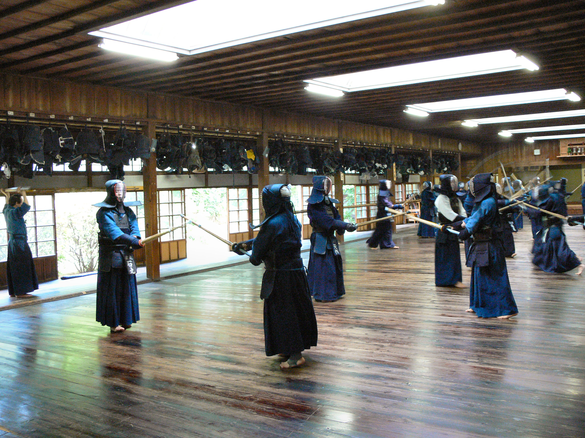

:icons: font

== Microservices-Dojo

This is the comprehensive follow-step-by-step guide that will teach you to build
12 Factor Cloud-native applications and get educated on the surrounding ecosystem.

This Dojo is a play ground that helps to bootstrap teams and individuals to
the point when they understand basics of the micro-services and operational
complexity.

This block of Katas (exercises) walk you through a Step-by-step process of
connecting 2 web services and exposing their functionality to the rest of
the world.

Read the whole <<dojo_story.adoc#,Dojo Story>> for more details. This Story
can be represented with this technology logo collage:

image::images/dojo-logo-collage.png[Dojo Logo Collage]

IMPORTANT: Follow the <<environment/environment.adoc#,configuration instructions>> on how to prepare your machine for Katas.

[%header%autowidth]
|=======================
|Kata #|Description      |Tech Stack
| 1 | <<kata1/creating_basic_web_service.adoc#,Creating Basic Web Service>> | Spring Cloud
| 2 | <<kata2/dockerizing_application.adoc#,Dockerizing Application>> | Docker
| 3 | <<kata3/service_using_mysql_db.html#,Microservice with personal DB and database migrations>> | Flyway
| 4 | <<kata4/externalizing_configuration.adoc#,Externalizing configuration>> |
| 5 | <<kata5/service_using_mongo_db.adoc#,Web Service using Mongo DB>> |
| 6 | <<kata6/service_talking_to_service.html#,Service talking to another Service>> | Eureka, Ribbon and Feign
| 7 | Circuit Breakers | Hystrix
| 8 | <<kata8/edge_service.adoc#,Edge Service>> | Zuul
|=======================

Complimentary Katas:
[%header%autowidth]
|=======================
|Kata #|Description      |Tech Stack
| a | <<kata-web-client/web-client-basics.adoc#,Getting Started with Web client>> |covers beginning of AngularJS
| b | <<kata-dev-environment/simple-orchestration.adoc#,Simple Orchestration>> |
| c | Distributed Logging | ELK Stack
| d | Distributed Tracing | Zipkin
| e | <<kata-mesos/scheduling_with_mesos.adoc#,Mesos and Marathon framework>> | Mesos, Marathon
|=======================
