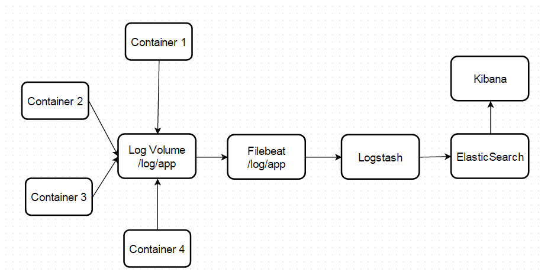
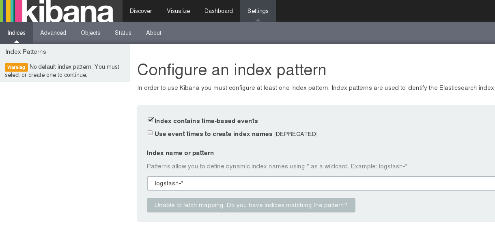
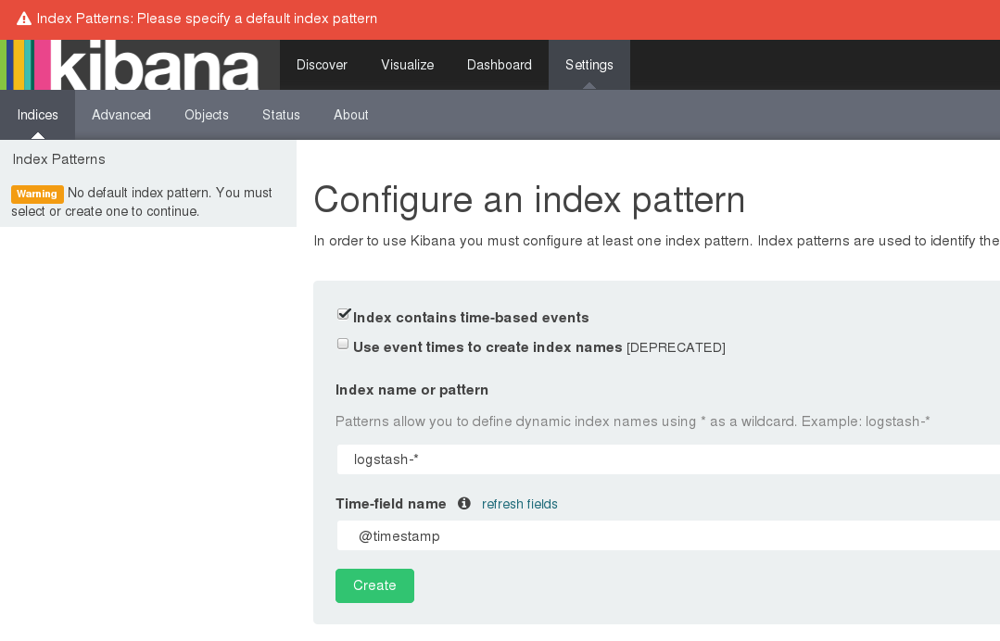

:kata_dir: kata-elk
:sourcedir: ../../../{kata_dir}
include::../header.adoc[]

== Aggregating Container Logs using Elasticsearch, Logbeat and Kibana

=== Overview

Cluster administrators can aggregate logs and
enable application developers to view them for a range of services
using the ELK stack https://www.elastic.co/videos/introduction-to-the-elk-stack[ELK
stack]. The ELK stack can be useful for viewing logs aggregated from
hosts and applications distributed using multiple containers.

Below components make up the ELK logging stack:

* https://www.elastic.co/products/elasticsearch[Elasticsearch]: an object store where all logs are stored.
* https://www.elastic.co/products/beats/filebeat[Filebeat]: gathers logs from nodes and feeds them to Elasticsearch.
* https://www.elastic.co/guide/en/kibana/current/introduction.html[Kibana]: a web UI for Elasticsearch.

Once deployed on a cluster, the stack aggregates logs from all nodes and
projects into Elasticsearch and provides a Kibana UI for users to view
logs that they have access to.

=== Pre-deployment Configuration

Deploying the ELK stack requires:

* A *Remote or Local Docker* environment properly configure
* A clone of github repository
* Ruby on Rails installed
* Ruby Gem Rake installed
* Rake gen installed
* asciidoctor installed for modification of documentation
* Install Docker Rack ( gem install docker_rack)

=== Cloning the Git Repository for ELK Stack

NOTE: installation of Docker and Docker Rack is out of scope of this tutorial

=== Launching the ELK Cluster

TIP: Make sure that the Docker machine / Host has enough resources to run all the containers

=== Building the Docker images

In the `kata-elk/baseos` directory run:
[source,text,options="nowrap"]
....
docker build -t baseos .

....
Validate that the `baseos` docker image create successfully
[source,text,options="nowrap"]
....
$ docker images
REPOSITORY          TAG                 IMAGE ID            CREATED             VIRTUAL SIZE
baseos              latest              1dc121e6f9a4        About an hour ago   468.3 MB
....

In the `kata-elk/filebeat` directory run:
[source,text,options="nowrap"]
....
docker build -t filebeat .

....
Validate that the filebeat docker image create successfully
[source,text,options="nowrap"]
....
$ docker images
REPOSITORY          TAG                 IMAGE ID            CREATED             VIRTUAL SIZE
filebeat            latest              a1c12df7e62d        23 minutes ago      502.9 MB
....

In the `kata-elk/logstash` directory run:
[source,text,options="nowrap"]
....
docker build -t logstash .

....
Validate that the filebeat docker image create successfully
[source,text,options="nowrap"]
....
$ docker images
REPOSITORY          TAG                 IMAGE ID            CREATED             VIRTUAL SIZE
logstash            latest              54c53f34852c        15 minutes ago      447.4 MB
logstash            2.1.1               9dc10e4d1616        4 weeks ago         447.4 MB
....

=== Starting the docker container for ELK Stack

In the `kata-elk/` directory run:
[source,text,options="nowrap"]
....
$ \Dev\accordance\microservice-dojo\kata-elk\>docker_rack exec elk:start
Executing 'elk:start'
Starting: /microservice-dojo/kata-elk/container_templates/elasticSearchData.yml
Starting: /Dev/microservice-dojo/kata-elk/container_templates/elasticsearch.yml
Starting: /Dev/microservice-dojo/kata-elk/container_templates/logstash.yml
Starting: /Dev/microservice-dojo/kata-elk/container_templates/kibana.yml
Starting: /Dev/microservice-dojo/kata-elk/container_templates/logData.yml
Starting: /Dev/microservice-dojo/kata-elk/container_templates/fileBeat.yml

....

Validate that you have all the containers running:
[source,text,options="nowrap"]
....
$ docker ps
CONTAINER ID        IMAGE                 NAMES
4e9c404ca604        filebeat              fileBeat
2ce55ad7048d        kibana:4.3.1          kibana
933d50d36182        logstash:2.1.1        logstash
ec9d3f836b4a        elasticsearch:2.1.1   elasticsearch
....

=== Launching the Kibana UI

Kibana dashboard: http://dockerhost::5601/

[NOTE] `if there are no logs stream to `logstash` and elastic search `kibana` will not be able to fetch the mapping and allow to configure the index.``

=== Generate some logs

[source,text,options="nowrap"]
....

$ docker exec -it fileBeat bash
$ cd log/app
$ vi test.log

Add some log lines and save the file using !wq command

....

Configuring Index pattern to kibana

Navigate to http://dockerhost::5601/

Click on setting -> indices as below screen shot and click create

Click on Discover menu and you should be able to see the log lines saved in above steps.

