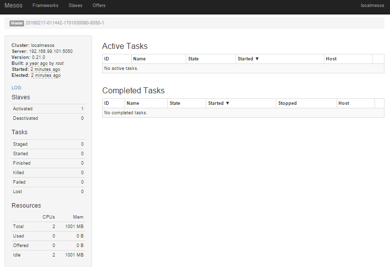
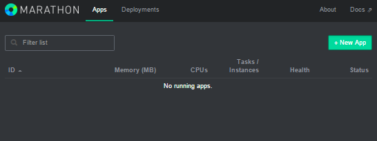

:kata_dir: kata-mesos
:sourcedir: ../../../{kata_dir}
include::../header.adoc[]

== Scheduling Application in Mesos with Marathon

WARNING: In this Kata we're going to use single-machine Mesos deployment to
learn about Mesos platform. This type of a deployment provides full Mesos
functionality without resiliency for platform failures. Do not use single-machine
deployment in production!

=== Launching Mesos Cluster with Marathon framework

In the `kata-mesos/solution1` directory run:
....
$ C:\Dev\accordance\microservice-dojo\kata-mesos\solution1>docker_rack exec mesos:start
Executing 'mesos:start'
Starting: /kata-mesos/solution1/container_templates/mesos_master.erb.yml
Starting: /kata-mesos/solution1/container_templates/zookeeper.yml
Starting: /kata-mesos/solution1/container_templates/mesos_slave.erb.yml
Starting: /kata-mesos/solution1/container_templates/mesos_marathon.erb.yml
....

Validate that you have all the containers running:
....
$ docker ps
CONTAINER ID        IMAGE                          NAMES
e8fa3e206f37        mesosphere/marathon:v0.11.1    mesos_marathon
034b6f341ccf        redjack/mesos-slave:0.21.0     mesos_slave
72cc80b78a75        redjack/mesos-master:0.21.0    mesos_master
dd487551c190        jplock/zookeeper:3.4.6         zookeeper
....

=== Dashboards

Mesos dashboard: http://dockerhost:5050/

Marathon dashboard: http://dockerhost:8282/ui/#/apps

video::OHf-NFVL1ps[youtube,height=600,width=800]

=== Scheduling a Job using Marathon

video::gEgH96Wq034[youtube,height=600,width=800]

TIP: Now you can go a try to kill a running application - Mesos will notify
Marathon about an instance loss and Marathon will reschedule the task. This
"dance" ensures that your application instance will always be running.
