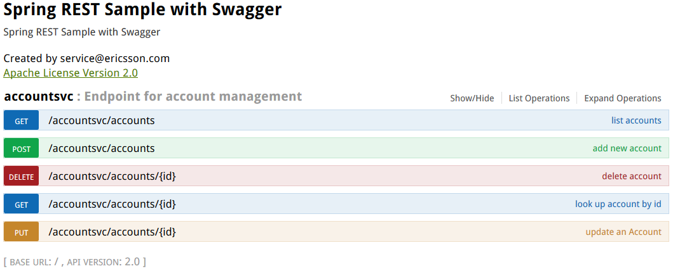

:kata_dir: kata-swagger
:sourcedir: ../../../{kata_dir}/solution/accounts-service
include::../header.adoc[]

== Embedding live service contracts documentation with Swagger

Swagger is a REST specification that allows you to generate interactive API documentation.

. Swagger generates an interactive API console to quickly learn and try the API.
. Swagger generates the client SDK code needed for implementations on various platforms.
. Swagger allows to generate client code on a lot of different platforms.
. Swagger has a strong community with helpful contributors.

In this exercise you are going to create simple REST web service using Swagger API Documentation.

WARNING: The API documentation generated by the Swagger file is minimal. It shows the resources, parameters, requests, and responses. However, it's not going to provide any other detail about how your API works.

== Step-by-step instructions to bootstrap the project

Follow Kata1 guide to setup a basic service: <<../kata1/creating_basic_web_service.adoc#,Creating Basic Web Service>>

== Swagger Implementation

=== Add dependency jars

Add the following code to the build script:
[source,groovy,indent=0]
.build.gradle
----
include::{sourcedir}/build.gradle[tags=swagger]
----

This script will add swagger dependency jars into the application.

=== Bean configuration
The project contains an entry point in the _Application.java_ file:

[source,java,indent=0,options="nowrap"]
.Application.java
----
include::{sourcedir}/src/main/java/msvcdojo/Application.java[tags=code]
----
<1> We have added @EnableSwagger2 annotation to enable this application to use Swagger.

<2> The api() method creates a bean which contains the general information about the API and an inventory of the available resources.

We're going to rename HomeController we created in Kata1 guide to AccountController and add a get API and describe it with swagger annotation.

=== Swagger annotation

[source,java,indent=0,options="nowrap"]
.AccountController.java
----
include::{sourcedir}/src/main/java/msvcdojo/Application.java[tags=api]
include::{sourcedir}/src/main/java/msvcdojo/Application.java[tags=doc]
include::{sourcedir}/src/main/java/msvcdojo/Application.java[tags=model]
----

<1> @Api annotation describes a top-level api. In order to make Swagger aware of your endpoint, you need to annotate your class with @Api annotation.

<2> @ApiOperation annotation provides detailed description of what a certain method does.

<3> @ApiResponses annotation represents a type of response from a server. This can be used to describe both success codes as well as errors. If your Api has different response classes, you can describe them here by associating a response class with a response code.

<4> @ApiImplicitParams annotation represents a single parameter in an API Operation.This allows you to manually define a parameter in a fine-tuned manner.

<5> @ApiParam annotation represents a single parameter in an Api Operation. A parameter is an input to the operation.When working with path or query parameter, you should always provide clarification of what this parameter represents.

<6> @ApiModel annotation models classes to provide the model schema, which helps in understanding/documenting the request response structure using the specific annotation using @ApiModel annotations.

[source,yaml,indent=0]
.application.yml
----
include::{sourcedir}/src/main/resources/application.yml[]
----

== Build and launch
Build the service:
----
$ cd accountsvc
$ gradle build
----
Note that this command will build the code, generate the jar and run all the necessary tests.

=== Building a Docker image

Build the project and generate Dockerfile by run the following command:
----
$ gradle prepDocker
...
:prepDocker
Run command: docker build -t msvcdojo/accounts-service:0.0.1 build/docker

BUILD SUCCESSFUL
----
Everything was prepared for you, so you can just copy the suggested command from
the console and run it:
----
$ docker build -t msvcdojo/accounts-service:0.0.1 build/docker
Sending build context to Docker daemon 12.95 MB
Step 1 : FROM java:8
Step 2 : MAINTAINER Igor Moochnick "igor@igorshare.com"
Step 3 : VOLUME /tmp
Step 4 : EXPOSE 8100
Step 5 : ADD accountsvc-0.0.1.jar accountsvc.jar
Step 6 : ENTRYPOINT java -Djava.security.egd=file:/dev/./urandom -jar /accounts-service.jar
Successfully built cb55f79088db
----

This has created a Dockerimage with the tag *msvcdojo/accounts-service:0.0.1*. Now let's see
it in the Docker repository:
[source,text,options="nowrap"]
----
$ docker images
REPOSITORY                  TAG                 IMAGE ID            CREATED             VIRTUAL SIZE
msvcdojo/accounts-service   0.0.1               fdb0ace78a40        2 minutes ago       660.6 MB
----

== Start container

Let's start the container and map the service port to the external world by running command:
----
$ docker run -it --name=accountsvc -p 8100:8100 msvcdojo/accounts-service:0.0.1
----
The following output you'll see on the screen.

[source,text,options="nowrap"]
----
include::bootRun.txt[]
----
<1> Listening port of the web service

== Play time

=== Swagger Endpoint Resource Listing
The Resource Listing serves as the root document for the API description. It contains general information about the API and an inventory of the available resources.

By default, this document SHOULD be served at the /api-docs path.
----
$ curl http://localhost:8100/v2/api-docs
----

The output of this CURL command will look like this:

[source,json,indent=0]
----
{
    "swagger": "2.0",
    "info": {
    "description": "Spring REST Sample with Swagger",
    "version": "2.0",
    "title": "Spring REST Sample with Swagger",
	...
	},
"host": "localhost:8100",
"basePath": "/",
"tags": [{
    "name": "accountsvc",
    "description": "Endpoint for account management"
}
"paths": {
    "/accountsvc/delete/{id}": {
		"delete": {
			"tags": ["accountsvc"],
			"summary": "delete Account By Id",
			"description": "Deletes an account by passing accountId",
			"operationId": "deleteUsingDELETE",
			"consumes": ["application/json"],
			"produces": ["*/*"],
			...
			}
		}
	}
}
----

=== Running it with Swagger UI

Swagger UI takes Swagger specification files, presents them visually and allows you to execute operations.

----
$ curl http://localhost:8100/swagger-ui.html
----

The output of this CURL command will look like this:

[.thumb]

