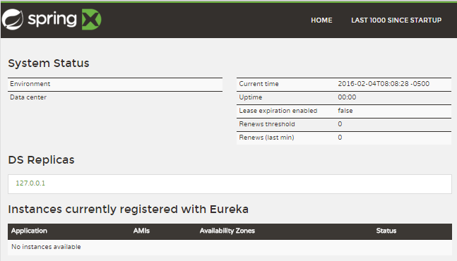
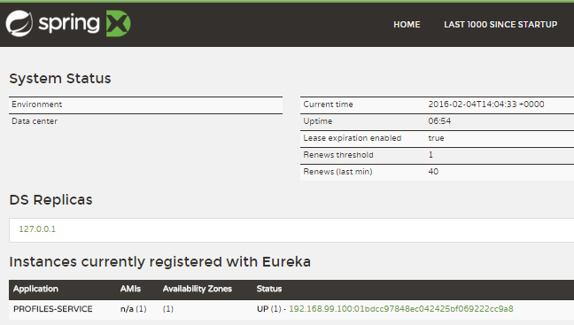

:toc: left
:icons: font
:source-highlighter: coderay
:kata_dir: kata6
:sourcedir: ../../../{kata_dir}

== Service talking to another Service

There is not a lot of fun in having only a single micro-service. Let's see
discover how the micro-services can work together to achieve a task.

IMPORTANT: Consider using micro-service patterns when the operational costs
are manageable. The size of the micro-service should not be smaller than
needed to avoid creation of unreasonable operational overhead.

WARNING: This kata is showing ways of connecting micro-services and not the
best practices of how to design them. You have to apply system analysis and
system architectural patterns to identify the best ways to split functionality
into multiple services.

In this Kata we're going to let Accounts service connect and use data provided
by Profiles service.

=== Getting Started

TIP: The starting source code is located in {kata_dir}/start folder

We have to services: Accounts service and Profiles service. The accounts service
is managing list of user accounts in our system and profiles service is in charge
of managing user social profiles.

In this kata we're going to teach Accounts service to extract some personal
information of a user from Profiles service when it is asked about user account.

[ditaa, "simple-connection", png]
....
       +-------------+            +-------------+
       |   Accounts  |            |   Profiles  |
       |   Service   +----------->|   Service   |
       +------+------+            +------+------+
              |                          |
              v                          v
       +-------------+            +-------------+
       |    DB  cBLU |            |    DB  cBLU |
       |    mySql{s} |            |    Mongo{s} |
       +-------------+            +-------------+
....

== Eureka
=== Eureka: Service Catalog

In distributed systems there should be a way for one service to connect to another.
This can be facilitated through a couple of different ways:

. Configuration of an IP address
. Using a DNS record
. Using s Service Catalog/Registry

Going forward we're going to use http://techblog.netflix.com/2012/09/eureka.html[Eureka from Netflix^]
as our Service Catalog.

Spring Cloud provides a very simple way to build your own Eureka-based service
catalog by embedding eureka in one of your services.

Let's build one of our own. Create an empty Spring Boot application.

Add Eureka starter package into your class pass by adding the following
compile dependency into your build:

[source,groovy,indent=0]
.eureka-service/build.gradle
----
include::{sourcedir}/solution1/eureka-service/build.gradle[tags=eureka]
----

Annotate application class with `@EnableEurekaServer` attribute:

[source,java,indent=0]
.src/main/java/msvcdojo/ProfilesServiceApplication.java
----
include::{sourcedir}/solution1/eureka-service/src/main/java/msvcdojo/EurekaServiceApplication.java[tags=eureka]
----

Build and launch application. Ensure that you have Configuration Service running
prior the launch (see Externalizing Configuration kata).

Open your browser and navigate to icon:external-link[link="http://localhost:8761/", window="_blank"]
http://localhost:8761/. You're going to see Eureka dashboard:

=== Registering with Service Catalog

From now on each instance of a service should register with Eureka on start and
continue keeping it record up-to-date throughout it's lifecycle.

Add the Eureka starter package as compile dependency for a service:
[source,groovy,indent=0]
.profiles-service/build.gradle
----
include::{sourcedir}/solution1/profiles-service/build.gradle[tags=eureka]
----

Annotate application class with `@EnableEurekaClient` attribute:

[source,java,indent=0]
.src/main/java/msvcdojo/ProfilesServiceApplication.java
----
include::{sourcedir}/solution1/profiles-service/src/main/java/msvcdojo/ProfilesServiceApplication.java[tags=eureka]
----

What's left is to tell the Eureka client where to find the Eureka server.
We need to add the configuration block below to all our Web services by
putting it into a shared configuration in `application.yml` shipped by
Configuration service from GitHub:

[source,yml,indent=0]
.https://github.com/Accordance/microservice-dojo-configuration/blob/master/application.yml
----
include::https://raw.githubusercontent.com/Accordance/microservice-dojo-configuration/master/application.yml[tags=eureka]
----

Build and start your service. Navigate to icon:external-link[link="http://localhost:8761/", window="_blank"]
http://localhost:8761/[Eureka dashboard^] and you're going to see your service
registered with Eureka:

TIP: Repeat the same process for all of your Web Services from now on.

=== Service Discovery via Discovery Client

NOTE: Remember to enable Eureka client for Accounts service.

Now we're going to let the Accounts Service locate the Profiles Service via
Discovery client:

[source,java,indent=0]
.src/main/java/msvcdojo/AccountsServiceApplication.java
----
include::{sourcedir}/solution1/accounts-service/src/main/java/msvcdojo/AccountsServiceApplication.java[tags=discovery-client]
----

There are a couple of Discovery clients, so make sure you are using this:
[source,java,indent=0]
.src/main/java/msvcdojo/AccountsServiceApplication.java
----
include::{sourcedir}/solution1/accounts-service/src/main/java/msvcdojo/AccountsServiceApplication.java[tags=import-discovery-client]
----

Now each time an Account resource is retrieved we'd like to augment it with
additional information:

[source,java,indent=0]
.src/main/java/msvcdojo/AccountsServiceApplication.java
----
include::{sourcedir}/solution1/accounts-service/src/main/java/msvcdojo/AccountsServiceApplication.java[tags=account-resource]
----

Build and start Accounts Service. Request the account information by ID 1:
....
$ curl http://localhost:8100/accounts/1
{
  "username" : "john",
  "role" : "admin",
  "_links" : {
    "self" : {
      "href" : "http://localhost:8100/accounts/1"
    },
    "account" : {
      "href" : "http://localhost:8100/accounts/1"
    },
    "profile" : {
      "href" : "http://192.168.99.100:8101/profiles/john"
    }
  }
}
....

== Ribbon
=== Service Discovery via Ribbon load balancer

Discovery client allows you to communicate with Eureka and receive a full list
of available instance of another service. Then you can make your own decision
which one of these IPs to call. Sometimes it is an easy decision, like random
one, but, in most cases you want to have smarter algorithm. Such algorithms
can take into consideration geo-location of the services, stability, network
latency and other attributes. This means you need to have a pretty smart Load
Balancer.

Lucky for us, Netflix guys have build one called Ribbon. Ribbon Load Balancers
have extensible architecture which allows you to plug in your own decision logic,
but today we're going to use a default Ribbon Load balancer.

Mofify `ProfilesClient` to use Ribbon load balanecer:
[source,java,indent=0]
.src/main/java/msvcdojo/AccountsServiceApplication.java
----
include::{sourcedir}/solution1/accounts-service/src/main/java/msvcdojo/AccountsServiceApplication.java[tags=ribbon]
----

If you build and start, you should get exactly the same behavior as before:
....
$ curl http://localhost:8100/accounts/1
{
  "username" : "john",
  "role" : "admin",
  "_links" : {
    "self" : {
      "href" : "http://localhost:8100/accounts/1"
    },
    "account" : {
      "href" : "http://localhost:8100/accounts/1"
    },
    "profile" : {
      "href" : "http://192.168.99.100:8101/profiles/john"
    }
  }
}
....

Let's go a little further and augment returned Account information with the
information received from Profiles service. Let's add a fullName field to the
returned Account structure.

So we need to create a Profile entity that will wrap the response of the Profiles
service:
[source,java,indent=0]
.src/main/java/msvcdojo/AccountsServiceApplication.java
----
include::{sourcedir}/solution1/accounts-service/src/main/java/msvcdojo/AccountsServiceApplication.java[tags=profile]
----

Teach the `ProfilesClient` to extract profile information:
[source,java,indent=0]
.src/main/java/msvcdojo/AccountsServiceApplication.java
----
include::{sourcedir}/solution1/accounts-service/src/main/java/msvcdojo/AccountsServiceApplication.java[tags=getProfile]
----

As soon as our service will receive a Profile information, we're looking to update
the Account entity. Add the following code to the `Account` entity:

[source,java,indent=0]
.src/main/java/msvcdojo/AccountsServiceApplication.java
----
include::{sourcedir}/solution1/accounts-service/src/main/java/msvcdojo/AccountsServiceApplication.java[tags=accountProfileInfo]
----

Now let's teach the `AccountResourceProcessor` to call the Profiles service and
update `Account` entity with the appropriate information:

[source,java,indent=0]
.src/main/java/msvcdojo/AccountsServiceApplication.java
----
include::{sourcedir}/solution1/accounts-service/src/main/java/msvcdojo/AccountsServiceApplication.java[tags=updateAccountWithProfileInfo]
----

Build, lunch and hit your service:
....
$ curl localhost:8100/accounts/1
{
  "username" : "john",
  "role" : "admin",
  "fullName" : "John Smith",
  "photoCount" : 0,
  "_links" : {
    "self" : {
      "href" : "http://localhost:8100/accounts/1"
    },
    "account" : {
      "href" : "http://localhost:8100/accounts/1"
    },
    "profile" : {
      "href" : "http://192.168.99.100:8101/profiles/john"
    }
  }
}
....

Note that now we've received the `fullName` information in the `Account` entity.

== Feign
=== Inter-Service communication via Feign client

This was a lot of work so far and we're lucky that Netflix guys, after using
this for quite a while, have thought about an easier way of wrapping Inter-Service
communication.

They've provided a Feign library.

Let's remove `ProfilesClient::getProfile` method. Now we're going to create a
Feign client:

[source,java,indent=0]
.src/main/java/msvcdojo/AccountsServiceApplication.java
----
include::{sourcedir}/solution2/accounts-service/src/main/java/msvcdojo/AccountsServiceApplication.java[tags=feign-client]
----

NOTE: Note that the Feign client is an interface description of a remote service.
It's a description and not an implementation.

Modify `AccountResourceProcessor` constructor to receive an Feign proxy auto-generated
for you wrapper:

[source,java,indent=0]
.src/main/java/msvcdojo/AccountsServiceApplication.java
----
include::{sourcedir}/solution2/accounts-service/src/main/java/msvcdojo/AccountsServiceApplication.java[tags=feign-wiring]
----

Change the previous call to `getProfile` in the `AccountResourceProcessor::process`
function to this new shiny one:

[source,java,indent=0]
.src/main/java/msvcdojo/AccountsServiceApplication.java
----
include::{sourcedir}/solution2/accounts-service/src/main/java/msvcdojo/AccountsServiceApplication.java[tags=feign-using]
----

Build, launch and hit the service:
....
$ curl localhost:8100/accounts/1
{
  "username" : "john",
  "role" : "admin",
  "fullName" : "John Smith",
  "photoCount" : 0,
  "_links" : {
    "self" : {
      "href" : "http://localhost:8100/accounts/1"
    },
    "account" : {
      "href" : "http://localhost:8100/accounts/1"
    },
    "profile" : {
      "href" : "http://192.168.99.100:8101/profiles/john"
    }
  }
}
....

== Troubleshooting Feign communication

As you can see we're getting total magic. Sometimes magic is way too obscure
and, in cases, you'd like to see what is happening under the covers, you can
turn on the Feign logging.

Add the following code to control what will be logged (in this example we'd like
to see everything):
[source,java,indent=0]
.src/main/java/msvcdojo/AccountsServiceApplication.java
----
include::{sourcedir}/solution2/accounts-service/src/main/java/msvcdojo/AccountsServiceApplication.java[tags=feign-logging]
----

And then for each Feign client you need to add log-level control in the *applicaiton.yml*:
[source,yml,indent=0]
.accounts-service/src/main/resources/application.yml
----
include::{sourcedir}/solution2/accounts-service/src/main/resources/application.yml[tags=feign-logging]
----

Now if you'll rerun your service and when you'll hit it with a REST request,
the similar to the following lines will appear in your logs:
....
2016-02-04 DEBUG [...] [ProfilesServiceProxy#getProfile] ---> GET http://profiles-service/profiles/john HTTP/1.1
2016-02-04 DEBUG [...] [ProfilesServiceProxy#getProfile] ---> END HTTP (0-byte body)
2016-02-04 DEBUG [...] [ProfilesServiceProxy#getProfile] <--- HTTP/1.1 200 OK (139ms)
2016-02-04 DEBUG [...] [ProfilesServiceProxy#getProfile] Transfer-Encoding: chunked
2016-02-04 DEBUG [...] [ProfilesServiceProxy#getProfile] Server: Jetty(9.2.14.v20151106)
2016-02-04 DEBUG [...] [ProfilesServiceProxy#getProfile] X-Application-Context: profiles-service
2016-02-04 DEBUG [...] [ProfilesServiceProxy#getProfile] Date: Thu, 04 Feb 2016 17:32:44 GMT
2016-02-04 DEBUG [...] [ProfilesServiceProxy#getProfile] Content-Type: application/hal+json; charset=UTF-8
2016-02-04 DEBUG [...] [ProfilesServiceProxy#getProfile]
2016-02-04 DEBUG [...] [ProfilesServiceProxy#getProfile] {
  "fullName" : "John Smith",
  "photoCount" : 0,
  "key" : "john",
  "_links" : {
    "self" : {
      "href" : "http://192.168.99.100:8101/profiles/john"
    },
    "profile" : {
      "href" : "http://192.168.99.100:8101/profiles/john"
    },
    "photos" : {
      "href" : "http://192.168.99.100:8101/profiles/john/photos"
    }
  }
}
2016-02-04 DEBUG [...] [ProfilesServiceProxy#getProfile] <--- END HTTP (340-byte body)
....
