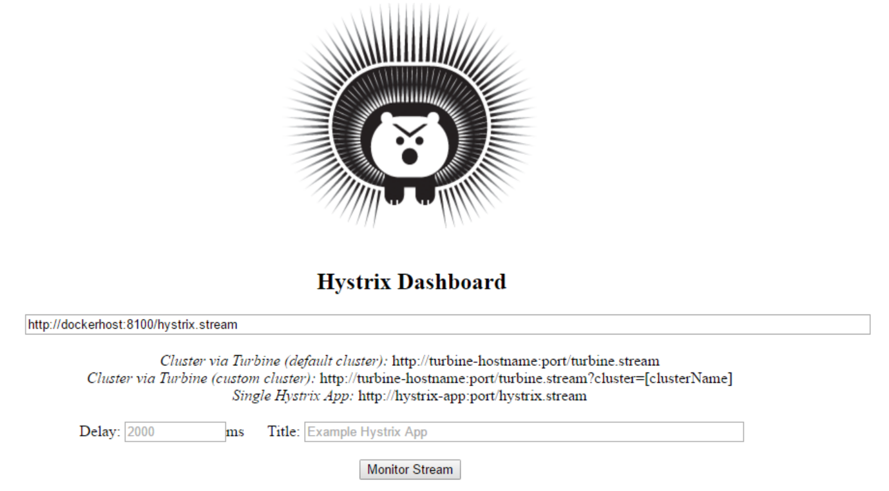
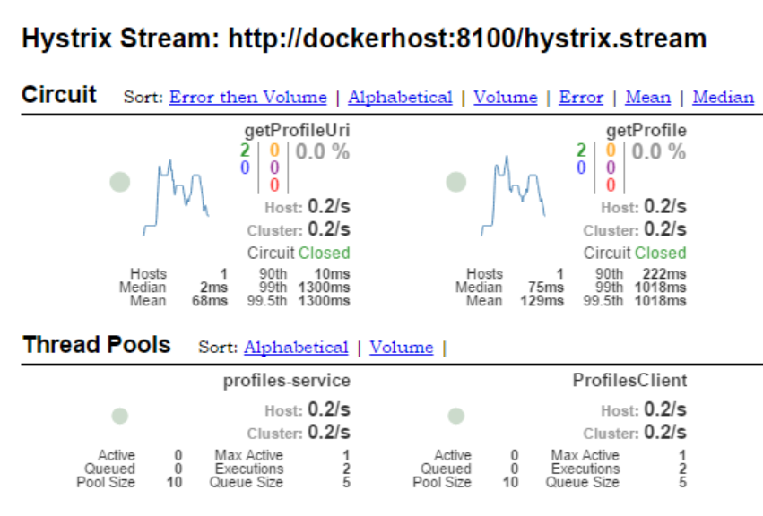
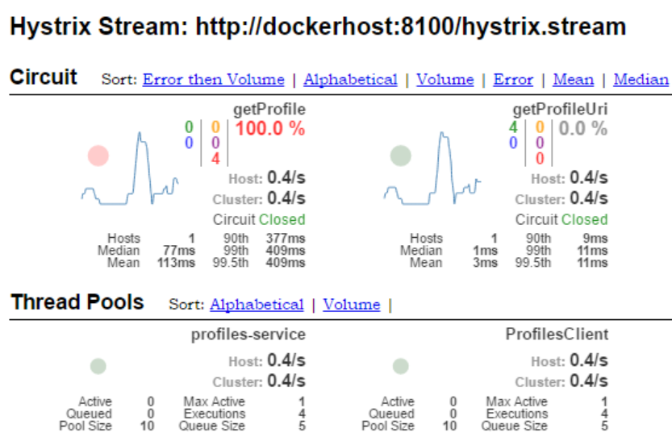
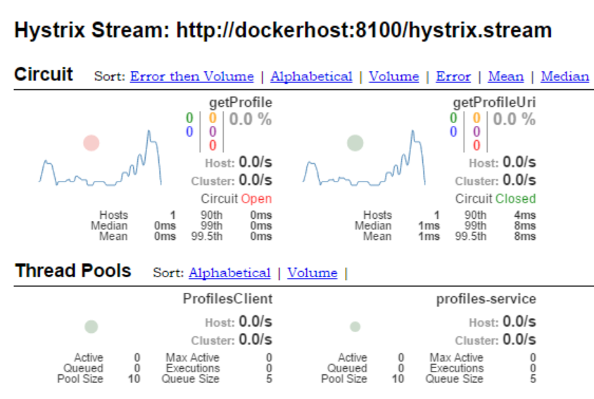

:kata_dir: kata7
:sourcedir: ../../../{kata_dir}
include::../header.adoc[]

== Circuit Breaker pattern

TIP: This Kata is based on the assumption that you're running the Config service,
Eureka service (Kata6) and Profiles Service (Kata6) in Docker.

WARNING: Under constructions

=== Enabling Hystrix in your application

Make sure that you have Actuator in your class-path

[source,groovy,indent=0]
.accounts-service/build.gradle
----
include::{sourcedir}/solution/accounts-service/build.gradle[tags=enable-actuator]
----

Add Hystrix to your application's class-path:
[source,groovy,indent=0]
.accounts-service/build.gradle
----
include::{sourcedir}/solution/accounts-service/build.gradle[tags=enable-hystrix]
----

Annotate your application with `@EnableHystrix`:
[source,java,indent=0]
.src/main/java/msvcdojo/AccountServiceApplication.java
----
include::{sourcedir}/solution/accounts-service/src/main/java/msvcdojo/AccountsServiceApplication.java[tags=enable-hystrix]
----

Open http://dockerhost:7980 to get to the Hystrix dashboard:

== Stressing circuit breakers

WARNING: Under construction

No problems detected in the application - everything is normal:

When one of the dependencies goes down, system detects errors - note red circle and error count:

When the amount of errors goes over a threshold - circuit breaker trips (notice "Open" status):

== Turbine dashboard

WARNING: Under construction
